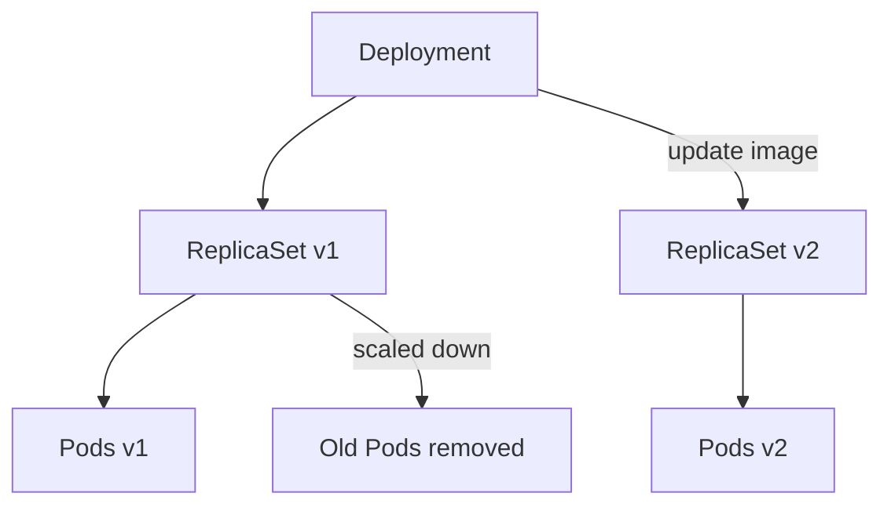

# Deployments

## Overview

A **Deployment** is a higher-level Kubernetes object used to manage stateless applications.

It sits above ReplicaSets and Pods, and provides:

- declarative updates
- easy scaling
- rolling updates with zero or minimal downtime
- rollback to previous versions
- revision history for changes

If Pods are the execution units and ReplicaSets maintain count, Deployment manages the full application lifecycle.

---

## Why Deployments Are Needed

ReplicaSets can keep Pods running, but managing version changes directly with ReplicaSets is hard and risky.

Common production needs:

- update image version safely
- avoid downtime during release
- roll back quickly if release fails
- track deployment history

Deployment solves these needs by orchestrating ReplicaSets for you.

---

## How Deployment Works Internally

A Deployment does not create Pods directly.

Flow:

1. Deployment creates a ReplicaSet
2. ReplicaSet creates Pods
3. On update, Deployment creates a new ReplicaSet with new Pod template
4. Deployment scales down old ReplicaSet and scales up new ReplicaSet progressively



This strategy enables controlled rollouts and safer production changes.

---

## Basic Deployment Manifest

```yaml
apiVersion: apps/v1
kind: Deployment
metadata:
	name: backend-deployment
	labels:
		app: backend-api
spec:
	replicas: 3
	selector:
		matchLabels:
			app: backend-api
	template:
		metadata:
			labels:
				app: backend-api
		spec:
			containers:
				- name: api
					image: nginx:1.25
					ports:
						- containerPort: 80
```

### Key Fields

| Field | Purpose |
|---|---|
| `spec.replicas` | Number of desired Pod replicas |
| `spec.selector` | Selects Pods managed by Deployment's ReplicaSet |
| `spec.template` | Pod template used to create new Pods |
| `containers.image` | Versioned application image to run |

Important:

- selector labels and template labels must match
- changing Pod template fields (like image) triggers a rollout

---

## Creating and Inspecting Deployments

### Create

```bash
kubectl apply -f deployment.yaml
```

### Inspect

```bash
# List deployments
kubectl get deployments

# Short alias
kubectl get deploy

# See associated ReplicaSets
kubectl get rs

# See pods
kubectl get pods -l app=backend-api

# Describe deployment details and events
kubectl describe deployment backend-deployment
```

---

## Scaling a Deployment

Scale declaratively by updating YAML or imperatively with command.

```bash
kubectl scale deployment backend-deployment --replicas=5
```

Verify:

```bash
kubectl get deploy backend-deployment
kubectl get pods -l app=backend-api
```

Kubernetes adjusts ReplicaSet and Pods to reach the new count.

---

## Rolling Updates

A rolling update replaces Pods gradually instead of stopping everything at once.

Example image update:

```bash
kubectl set image deployment/backend-deployment api=nginx:1.26
```

Watch rollout:

```bash
kubectl rollout status deployment/backend-deployment
```

During rollout:

- new Pods are created from new ReplicaSet
- old Pods are terminated step-by-step
- service availability is maintained

---

## Rollback

If a new version is unhealthy, rollback is quick.

```bash
# View revision history
kubectl rollout history deployment/backend-deployment

# Rollback to previous revision
kubectl rollout undo deployment/backend-deployment

# Rollback to a specific revision
kubectl rollout undo deployment/backend-deployment --to-revision=2
```

This is a major operational advantage over managing ReplicaSets directly.

---

## Deployment Strategy

Deployment supports rollout strategies under `spec.strategy`.

### 1. RollingUpdate (default)

- updates incrementally
- minimizes downtime
- supports `maxSurge` and `maxUnavailable`

### 2. Recreate

- terminates all old Pods first
- then creates new Pods
- causes downtime, but useful when old/new versions cannot run together

Example rolling strategy:

```yaml
spec:
	strategy:
		type: RollingUpdate
		rollingUpdate:
			maxSurge: 1
			maxUnavailable: 1
```

Interpretation:

- at most 1 extra Pod above desired count can be created (`maxSurge`)
- at most 1 Pod can be unavailable during update (`maxUnavailable`)

---

## Useful Deployment Commands

```bash
# Create or update deployment from file
kubectl apply -f deployment.yaml

# Edit deployment in place
kubectl edit deployment backend-deployment

# Check rollout status
kubectl rollout status deployment/backend-deployment

# Pause rollout
kubectl rollout pause deployment/backend-deployment

# Resume rollout
kubectl rollout resume deployment/backend-deployment

# Restart deployment (forces new Pods)
kubectl rollout restart deployment/backend-deployment

# Delete deployment
kubectl delete deployment backend-deployment
```

---

## Common Issues and Troubleshooting

### 1. Rollout stuck

Possible reasons:

- image pull error
- readiness probe failing
- insufficient resources

Check:

```bash
kubectl rollout status deployment/backend-deployment
kubectl describe deployment backend-deployment
kubectl describe pod <pod-name>
kubectl get events --sort-by=.metadata.creationTimestamp
```

### 2. New version never becomes ready

Possible reasons:

- app crash loop
- wrong env vars/secrets/config
- failed health checks

Check logs:

```bash
kubectl logs <pod-name>
kubectl logs <pod-name> -c <container-name>
```

### 3. No Pods created

Possible reasons:

- selector mismatch
- invalid manifest

Check deployment and ReplicaSet descriptions for validation events.

---

## Best Practices

- Use immutable, versioned image tags (`myapp:1.4.2`) instead of `latest`.
- Define readiness and liveness probes for safer rollouts.
- Set resource requests/limits to improve scheduling reliability.
- Use rolling updates for production unless recreate behavior is required.
- Keep deployment manifests in version control.
- Always verify rollout status after updates.

---

## Interview Questions

### 1. What is a Deployment in Kubernetes?

**Answer:**
A Deployment is a higher-level controller that manages ReplicaSets and Pods for stateless applications, providing scaling, rolling updates, rollbacks, and revision history.

---

### 2. How is Deployment different from ReplicaSet?

**Answer:**
ReplicaSet only ensures the desired number of Pods. Deployment manages ReplicaSets and adds rollout/rollback capabilities and release management.

---

### 3. What happens when you update the image in a Deployment?

**Answer:**
Kubernetes creates a new ReplicaSet with the updated Pod template, gradually scales it up, and scales down the old ReplicaSet according to rollout strategy.

---

### 4. How can you roll back a failed release?

**Answer:**
Use `kubectl rollout undo deployment/<name>` to revert to the previous revision, or specify `--to-revision` for a specific revision.

---

## Summary

* Deployment is the standard way to run stateless applications in Kubernetes

* It manages ReplicaSets and Pods using the desired state model

* Deployments support scaling, rolling updates, rollbacks, and history tracking

* Rolling updates reduce downtime by replacing Pods gradually

* Operationally, Deployments are preferred over directly managing ReplicaSets

Understanding Deployments is essential for reliable, production-grade Kubernetes releases.

