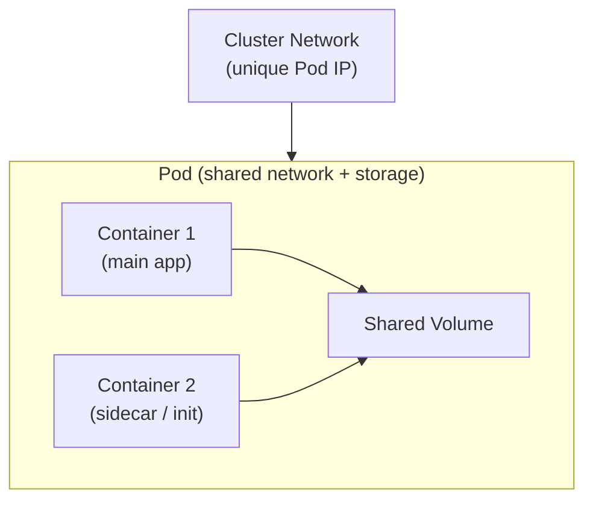
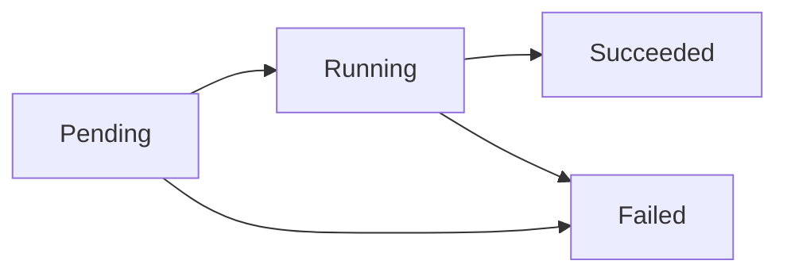

# Understand Pods

## Overview

A **Pod** is the smallest deployable unit in Kubernetes.

Rather than scheduling individual containers directly, Kubernetes always wraps one or more containers inside a Pod and manages them as a single unit.

Pods are the atomic building blocks on which every higher-level Kubernetes object — Deployments, StatefulSets, DaemonSets — is built.

Understanding Pods deeply is essential before working with any other Kubernetes concept.

---

## What a Pod Is

A Pod represents a **single instance of a running process** in the cluster.

It encapsulates:

- one or more tightly coupled containers
- shared network namespace (all containers in a Pod share the same IP address and port space)
- shared storage volumes
- a unique IP address within the cluster
- metadata and lifecycle configuration

Containers within the same Pod communicate via `localhost` and can share files through mounted volumes — they behave like processes running on the same machine.

---

## Why Kubernetes Uses Pods Instead of Bare Containers

Kubernetes does not schedule containers directly. It schedules Pods.

This design exists because some workloads need **multiple tightly coupled processes** that must run together, share state, and communicate with minimal overhead.

Examples of why containers are grouped in a Pod:

- a main application container + a log-shipping sidecar
- a web server container + a config-refreshing init container
- a service container + an Envoy proxy for service mesh

By bundling these together in a Pod, Kubernetes guarantees they are always co-located on the same node and share the same networking and storage context.

---

## Pod Internals



Every Pod gets:

- **one unique IP address** — shared by all containers inside it
- **one or more volumes** — optionally shared between containers
- **one lifecycle** — all containers start and stop together

---

## Anatomy of a Pod Spec

A Pod is defined in a YAML manifest. Here is a minimal example:

```yaml
apiVersion: v1
kind: Pod
metadata:
  name: backend-pod
  labels:
    app: backend
    env: production
spec:
  containers:
    - name: api-server
      image: myapp:1.0
      ports:
        - containerPort: 8080
      env:
        - name: DB_HOST
          value: "mysql-service"
      resources:
        requests:
          memory: "128Mi"
          cpu: "250m"
        limits:
          memory: "256Mi"
          cpu: "500m"
```

### Key Fields Explained

| Field | Purpose |
|---|---|
| `apiVersion` | Kubernetes API version for this resource |
| `kind` | Type of object — `Pod` in this case |
| `metadata.name` | Unique name for the Pod in its namespace |
| `metadata.labels` | Key-value tags used for selection and grouping |
| `spec.containers` | List of containers that run inside the Pod |
| `image` | Container image to pull and run |
| `ports.containerPort` | Port the container listens on (informational) |
| `env` | Environment variables injected into the container |
| `resources.requests` | Minimum CPU/memory the container needs |
| `resources.limits` | Maximum CPU/memory the container can use |

---

## Pod Lifecycle

A Pod moves through a series of phases from creation to termination.



### Phase Definitions

| Phase | Description |
|---|---|
| **Pending** | Pod has been accepted by the cluster but containers are not yet running — image may still be pulling |
| **Running** | At least one container is running, or is starting / restarting |
| **Succeeded** | All containers have exited with status 0 and will not be restarted |
| **Failed** | All containers have terminated, and at least one exited with a non-zero status |
| **Unknown** | The state of the Pod cannot be determined — typically a communication failure with the node |

---

## Container States Within a Pod

Each individual container inside a Pod has its own state, separate from the Pod phase.

| State | Description |
|---|---|
| **Waiting** | Container is not yet running — pulling an image or waiting on a dependency |
| **Running** | Container is executing without issues |
| **Terminated** | Container has exited — either successfully or with a failure code |

---

## Pod Networking

Every Pod is assigned a **unique IP address** from the cluster's internal network.

Key networking behaviours:

- all containers within a Pod share one IP — they communicate using `localhost`
- Pods communicate with other Pods using their Pod IP
- Pods do not need NAT to talk to each other within the cluster
- Pods are ephemeral — when a Pod is replaced, the new Pod gets a **different IP**

Because Pod IPs are short-lived, **Services** are used to provide a stable network address for a set of Pods.

---

## Pod Storage — Volumes

Containers inside a Pod can share data through **volumes**.

A volume is mounted into one or more containers and its lifecycle is tied to the Pod — not to any individual container.

```yaml
spec:
  volumes:
    - name: shared-logs
      emptyDir: {}
  containers:
    - name: app
      image: myapp:1.0
      volumeMounts:
        - name: shared-logs
          mountPath: /var/log/app
    - name: log-shipper
      image: fluentd:latest
      volumeMounts:
        - name: shared-logs
          mountPath: /logs
```

In this example, both containers read and write to the same directory using the `emptyDir` volume, which is created fresh when the Pod starts and deleted when the Pod stops.

---

## Pods Are Ephemeral

Pods are **not designed to be long-lived**.

When a Pod fails, crashes, or is evicted, Kubernetes creates a **new Pod** — it does not restart the same Pod instance. The new Pod is a fresh object with a new IP and potentially running on a different node.

This is why:

- Pods should not store important data inside the container filesystem — use **PersistentVolumes**
- Pods should not be referenced by IP — use **Services** for stable addressing
- Pods should not be managed directly at scale — use **Deployments** to manage Pod replicas

---

## Running and Inspecting Pods

### Creating a Pod

```bash
# Apply a Pod manifest
kubectl apply -f pod.yaml

# Run a one-off Pod quickly (for testing)
kubectl run test-pod --image=nginx --restart=Never
```

### Inspecting Pods

```bash
# List all pods in the current namespace
kubectl get pods

# View detailed info about a specific pod
kubectl describe pod backend-pod

# Get pod output as YAML
kubectl get pod backend-pod -o yaml
```

### Viewing Logs

```bash
# View logs of the default container in a pod
kubectl logs backend-pod

# Specify a container in a multi-container pod
kubectl logs backend-pod -c api-server

# Stream logs in real time
kubectl logs backend-pod -f
```

### Accessing a Pod Shell

```bash
# Open an interactive shell inside a container
kubectl exec -it backend-pod -- /bin/sh

# Run a one-off command
kubectl exec backend-pod -- env
```

### Deleting a Pod

```bash
# Delete a specific pod
kubectl delete pod backend-pod

# Delete all pods matching a label
kubectl delete pods -l app=backend
```

---

## Pod vs Deployment

Most production workloads do not use bare Pods — they use **Deployments**.

| Aspect | Bare Pod | Deployment |
|---|---|---|
| Created directly | Yes | No — manages Pods via ReplicaSet |
| Self-healing | No — deleted Pod is not replaced | Yes — replaces failed Pods automatically |
| Scaling | Manual | Declarative replica count |
| Rolling updates | Not supported | Built-in |
| Rollback | Not supported | Built-in |
| Recommended for production | No | Yes |

A bare Pod is useful for one-off tasks, debugging, and learning — not for production services.

---

## Interview Questions

### 1. What is a Pod in Kubernetes?

**Answer:**
A Pod is the smallest deployable unit in Kubernetes. It wraps one or more containers that share the same network namespace (IP, ports), storage volumes, and lifecycle.

---

### 2. Why does Kubernetes use Pods instead of scheduling containers directly?

**Answer:**
Some workloads require multiple tightly coupled processes to co-locate, share a network, and share storage. The Pod abstraction provides a logical co-scheduling unit that guarantees these containers always run on the same node with shared context.

---

### 3. What happens when a Pod fails?

**Answer:**
Kubernetes does not restart a failed Pod in place. If the Pod is managed by a Deployment or ReplicaSet, the controller creates a **new Pod** to replace it. A bare Pod, once deleted, is not replaced.

---

### 4. How do containers inside the same Pod communicate?

**Answer:**
They communicate via `localhost` because all containers in a Pod share the same network namespace and therefore the same IP address.

---


## Summary

* A **Pod** is the smallest Kubernetes unit that runs one or more containers sharing network, storage, and lifecycle

* Containers in a Pod share the same IP and communicate via `localhost`

* Pods are **ephemeral** — replaced (not restarted) with new IPs

* Multi-container patterns: **sidecar**, **init**, and **ambassador**

* Pod phases: Pending → Running → Succeeded/Failed (Unknown edge case); container states: Waiting/Running/Terminated

* Pods aren’t self-healing — use **Deployments** in production

* Debug using: `kubectl get/describe/logs/exec`

---
