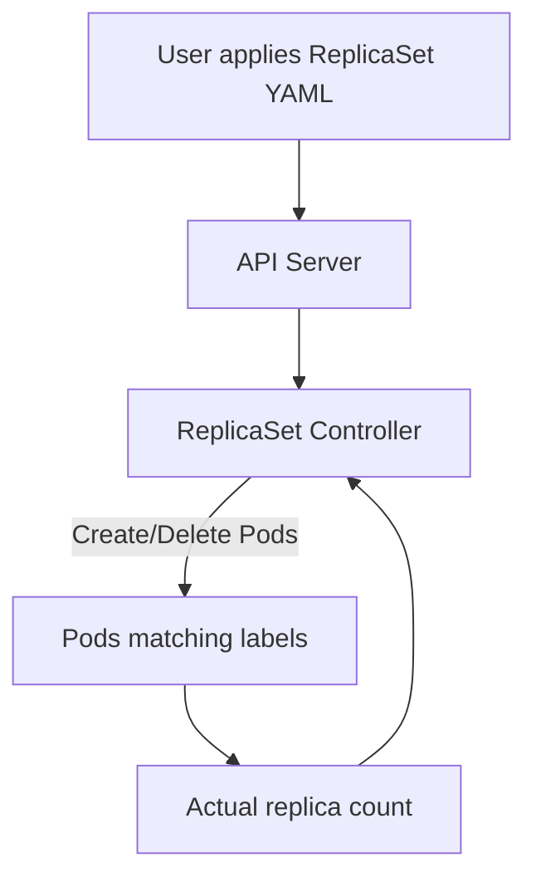

# ReplicaSets and Controllers

## Overview

In Kubernetes, a **controller** is a control loop that continuously watches the cluster state and moves it toward the desired state.

A **ReplicaSet** is one such controller. Its main job is simple but critical:

- ensure a specific number of Pod replicas are running at all times
- replace failed or deleted Pods automatically
- maintain availability for stateless workloads

If Pods are the smallest runtime unit, ReplicaSets are one of the first building blocks for reliability.

---

## What Is a Controller in Kubernetes?

Kubernetes is built around the **declarative model**:

1. you declare what you want (desired state)
2. Kubernetes compares it with what exists (actual state)
3. controllers reconcile the difference

This reconciliation happens continuously.

Examples of controllers:

- ReplicaSet controller
- Deployment controller
- StatefulSet controller
- DaemonSet controller
- Job controller
- Node controller

Each controller focuses on one resource type and one responsibility.

---

## Why ReplicaSets Exist

A single Pod is fragile:

- if the node fails, the Pod is gone
- if the Pod crashes, that instance is unavailable
- if the Pod is manually deleted, no automatic replacement happens unless controlled

ReplicaSet solves this by enforcing a replica count.

If desired replicas is `3`, the controller guarantees `3` matching Pods are running.

- if 1 Pod fails, ReplicaSet creates a new one
- if a node dies, missing Pods are recreated on healthy nodes
- if someone deletes a Pod, ReplicaSet recreates it

---

## ReplicaSet Architecture



The ReplicaSet controller constantly watches:

- target replica count in ReplicaSet spec
- Pods selected by label selector
- health and existence of those Pods

It then creates or removes Pods to keep counts aligned.

---

## Anatomy of a ReplicaSet Manifest

```yaml
apiVersion: apps/v1
kind: ReplicaSet
metadata:
	name: api-rs
	labels:
		app: backend-api
spec:
	replicas: 3
	selector:
		matchLabels:
			app: backend-api
	template:
		metadata:
			labels:
				app: backend-api
		spec:
			containers:
				- name: api
					image: nginx:1.25
					ports:
						- containerPort: 80
```

### Key Fields

| Field | Purpose |
|---|---|
| `apiVersion` | ReplicaSet is in the `apps/v1` API group |
| `kind` | Resource type is `ReplicaSet` |
| `metadata.name` | Name of the ReplicaSet object |
| `spec.replicas` | Desired number of Pod replicas |
| `spec.selector` | Label query used to identify Pods managed by this ReplicaSet |
| `spec.template` | Pod template used when creating new Pods |
| `template.metadata.labels` | Must match selector labels |

Important rule:

`spec.selector.matchLabels` must match `spec.template.metadata.labels`. If they do not align, the ReplicaSet cannot correctly manage its Pods.

---

## How ReplicaSet Reconciliation Works

Suppose desired replicas = `3`.

### Case 1: Actual replicas = 2

ReplicaSet creates 1 new Pod.

### Case 2: Actual replicas = 4

ReplicaSet deletes 1 Pod.

### Case 3: A Pod crashes or node disappears

ReplicaSet notices the missing Pod and creates a replacement.

This behavior is why ReplicaSet is foundational for high availability.

---

## Labels and Selectors

ReplicaSet uses labels to decide ownership.

Example labels on Pods:

```yaml
labels:
	app: backend-api
	tier: web
```

Example selector:

```yaml
selector:
	matchLabels:
		app: backend-api
```

Any Pod with `app=backend-api` may be considered by this ReplicaSet.

Best practice:

- keep selectors specific enough to avoid accidental Pod adoption
- avoid overlapping selectors between multiple controllers in the same namespace

---

## Creating and Managing a ReplicaSet

### Create

```bash
kubectl apply -f replicaset.yaml
```

### Inspect

```bash
# List ReplicaSets
kubectl get rs

# Detailed status and events
kubectl describe rs api-rs

# List Pods created by the ReplicaSet
kubectl get pods -l app=backend-api
```

### Scale

```bash
# Scale to 5 replicas
kubectl scale rs api-rs --replicas=5

# Verify
kubectl get rs
kubectl get pods -l app=backend-api
```

### Test Self-Healing

```bash
# Delete one Pod manually
kubectl delete pod <pod-name>

# Observe recreation
kubectl get pods -l app=backend-api -w
```

The deleted Pod is replaced automatically by the ReplicaSet controller.

---

## ReplicaSet vs ReplicationController

Before ReplicaSet, Kubernetes used **ReplicationController (RC)**.

ReplicaSet is the modern replacement.

| Feature | ReplicationController | ReplicaSet |
|---|---|---|
| API group | `v1` | `apps/v1` |
| Selector support | Equality-based only | Equality + set-based selectors |
| Current usage | Legacy | Standard |

In modern clusters, use ReplicaSet (usually through Deployments).

---

## ReplicaSet vs Deployment

You can create ReplicaSets directly, but production workflows usually use **Deployment**.

| Resource | Responsibility |
|---|---|
| ReplicaSet | Keeps a fixed number of Pods running |
| Deployment | Manages ReplicaSets and provides rolling updates, rollback, revision history |

Deployment creates and owns ReplicaSets behind the scenes.

Practical rule:

- use **ReplicaSet** to understand controller mechanics
- use **Deployment** for real application rollout and updates

---

## Common Issues and Troubleshooting

### 1. Selector and template labels mismatch

Symptom: ReplicaSet exists but Pods are not created/managed correctly.

Check:

```bash
kubectl describe rs api-rs
```

Fix: make sure `selector.matchLabels` exactly matches `template.metadata.labels`.

### 2. Pods stuck in Pending

Possible reasons:

- insufficient node resources
- image pull failures
- scheduling constraints

Check:

```bash
kubectl describe pod <pod-name>
kubectl get events --sort-by=.metadata.creationTimestamp
```

### 3. Unexpected Pod count

Possible reasons:

- manual scaling changed replicas
- overlapping label selectors with another controller

Check all controllers in namespace:

```bash
kubectl get deploy,rs,po --show-labels
```

---

## Best Practices

- Prefer Deployments over direct ReplicaSet usage for application workloads.

- Keep label conventions consistent (`app`, `tier`, `env`, `version`).

- Use resource requests/limits in Pod templates.

- Monitor controller events to diagnose reconciliation problems.

- Avoid manually editing Pods managed by a controller; update the owning manifest instead.

---

## Interview Questions

### 1. What is a controller in Kubernetes?

**Answer:**
A controller is a control loop that continuously watches the current state of cluster resources and reconciles it with the desired state defined in manifests.

---

### 2. What is the main purpose of a ReplicaSet?

**Answer:**
A ReplicaSet ensures a fixed number of Pod replicas are running at all times. If Pods fail, are deleted, or become unavailable, it creates replacements automatically.

---

### 3. How does a ReplicaSet know which Pods it should manage?

**Answer:**
ReplicaSet uses label selectors (`spec.selector.matchLabels`) to identify matching Pods. It manages Pods whose labels match that selector.

---

### 4. Why are Deployments preferred over creating ReplicaSets directly?

**Answer:**
Deployments provide higher-level lifecycle management, including rolling updates, rollbacks, and revision history. ReplicaSets are typically created and managed by Deployments behind the scenes.

---

## Summary

* A **controller** is Kubernetes' reconciliation mechanism that enforces desired state

* A **ReplicaSet** maintains a stable number of running Pods for availability

* ReplicaSet uses **labels and selectors** to identify and manage target Pods

* ReplicaSets provide self-healing by recreating missing Pods automatically

* In production, ReplicaSets are usually managed through **Deployments**

---
