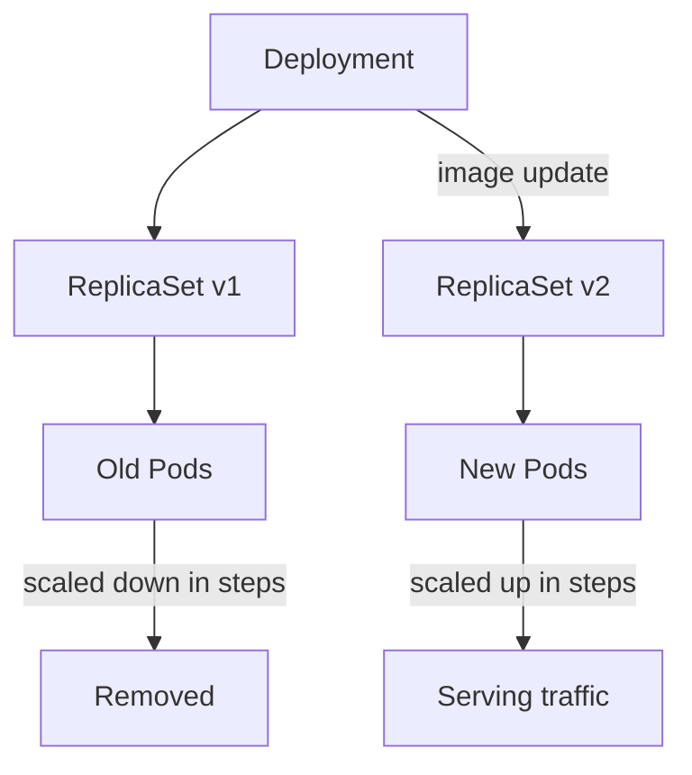

# Rolling Updates and Rollbacks

## Overview

In Kubernetes, application versions should be updated safely without disrupting users.

Two core Deployment capabilities make this possible:

- **Rolling Update**: gradually replace old Pods with new Pods
- **Rollback**: quickly return to a previous, known-good revision

These features reduce downtime risk, improve release confidence, and provide operational safety in production.

---

## Why Rolling Updates Matter

If all old Pods are terminated at once before new Pods become healthy, traffic can fail and users experience downtime.

A rolling update avoids this by updating incrementally:

- some old Pods continue serving traffic
- some new Pods start and become ready
- Kubernetes continues until the full rollout completes

This approach is ideal for stateless services managed by Deployments.

---

## How Rolling Updates Work Internally

When the Pod template changes (for example, container image tag), Deployment creates a new ReplicaSet and transitions traffic capacity gradually from old to new Pods.



Key point: Deployment does not replace all Pods instantly. It reconciles in controlled batches.

---

## Rolling Update Strategy Parameters

Under `spec.strategy.rollingUpdate`, two settings control rollout behavior.

| Field | Meaning |
|---|---|
| `maxSurge` | Maximum extra Pods created above desired replica count during update |
| `maxUnavailable` | Maximum Pods allowed to be unavailable during update |

Example with `replicas: 4`, `maxSurge: 1`, `maxUnavailable: 1`:

- at most 5 Pods may exist temporarily
- at least 3 Pods remain available during rollout

This balances speed and availability.

---

## Deployment Manifest with Rolling Update

```yaml
apiVersion: apps/v1
kind: Deployment
metadata:
	name: web-deployment
	labels:
		app: web
spec:
	replicas: 4
	strategy:
		type: RollingUpdate
		rollingUpdate:
			maxSurge: 1
			maxUnavailable: 1
	selector:
		matchLabels:
			app: web
	template:
		metadata:
			labels:
				app: web
		spec:
			containers:
				- name: web
					image: nginx:1.25
					ports:
						- containerPort: 80
```

---

## Triggering a Rolling Update

Rolling updates are triggered when Pod template fields change.

Most common update: container image version.

```bash
# Update image in running deployment
kubectl set image deployment/web-deployment web=nginx:1.26

# Watch rollout progress
kubectl rollout status deployment/web-deployment

# Inspect ReplicaSets during rollout
kubectl get rs
```

Alternative: update YAML and re-apply.

```bash
kubectl apply -f deployment.yaml
```

---

## Rollout History and Revisions

Each Deployment update creates a new revision.

You can inspect revision history:

```bash
kubectl rollout history deployment/web-deployment
```

Get details for a specific revision:

```bash
kubectl rollout history deployment/web-deployment --revision=2
```

Revision history is what enables fast rollback.

---

## Rollbacks

If a new release is faulty (crashes, failing probes, bad config), rollback restores a previous stable revision.

```bash
# Roll back to previous revision
kubectl rollout undo deployment/web-deployment

# Roll back to a specific revision
kubectl rollout undo deployment/web-deployment --to-revision=2
```

After rollback:

- Deployment scales down the problematic ReplicaSet
- previous ReplicaSet scales back up
- service stabilizes with known-good Pods

---

## Pause and Resume Rollouts

Useful when applying multiple related changes or validating in stages.

```bash
# Pause rollout
kubectl rollout pause deployment/web-deployment

# Resume rollout
kubectl rollout resume deployment/web-deployment
```

While paused, template changes are recorded but not rolled out until resumed.

---

## Recreate vs RollingUpdate

Deployment supports two strategy types.

| Strategy | Behavior | Downtime |
|---|---|---|
| `RollingUpdate` (default) | Replaces Pods gradually | Minimal or none |
| `Recreate` | Deletes all old Pods, then creates new Pods | Yes |

Use `Recreate` only when old and new versions cannot run together (for example, incompatible state or one-time migration constraints).

---

## Common Failure Scenarios

### 1. Rollout Stuck

Possible causes:

- image pull error
- readiness probe failing
- insufficient CPU/memory on nodes

Check:

```bash
kubectl rollout status deployment/web-deployment
kubectl describe deployment web-deployment
kubectl describe pod <pod-name>
kubectl get events --sort-by=.metadata.creationTimestamp
```

### 2. New Pods CrashLoopBackOff

Possible causes:

- app startup failure
- invalid environment variables or secrets
- bad command/entrypoint

Check logs:

```bash
kubectl logs <pod-name>
kubectl logs <pod-name> -c <container-name>
```

### 3. Service Errors During Rollout

Possible causes:

- readiness probes missing or too weak
- update happens faster than app warm-up

Mitigation:

- configure robust readiness probes
- reduce `maxUnavailable`
- tune startup timings

---

## Best Practices

- Use immutable image tags like `myapp:1.4.2`; avoid `latest` in production.

- Define readiness and liveness probes before enabling frequent rollouts.

- Keep rollout history (`revisionHistoryLimit`) sufficient for safe rollback.

- Choose conservative rollout settings for critical services.

- Monitor rollout events, logs, and application metrics during release.

- Practice rollback drills in non-production environments.

---

## Interview Questions

### 1. What is a rolling update in Kubernetes?

**Answer:**
A rolling update is a Deployment strategy where old Pods are replaced gradually with new Pods, allowing the application to remain available during version upgrades.

---

### 2. What is the difference between `maxSurge` and `maxUnavailable`?

**Answer:**
`maxSurge` controls how many extra Pods can be created above desired replicas during update, while `maxUnavailable` controls how many Pods are allowed to be unavailable during rollout.

---

### 3. How do you rollback a failed deployment?

**Answer:**
Use `kubectl rollout undo deployment/<name>` to return to the previous revision, or specify `--to-revision=<n>` for a specific target revision.

---

### 4. When would you use `Recreate` instead of `RollingUpdate`?

**Answer:**
Use `Recreate` when old and new versions cannot coexist, even briefly. It causes downtime, so it is used only for special compatibility constraints.

---

## Summary

* Rolling updates allow safe, incremental application version changes with minimal downtime

* Deployments manage rolling updates and maintain revision history for rollbacks

* Proper configuration of rollout parameters and probes is essential for successful updates

* Monitoring and quick rollback capabilities are critical for production reliability

---