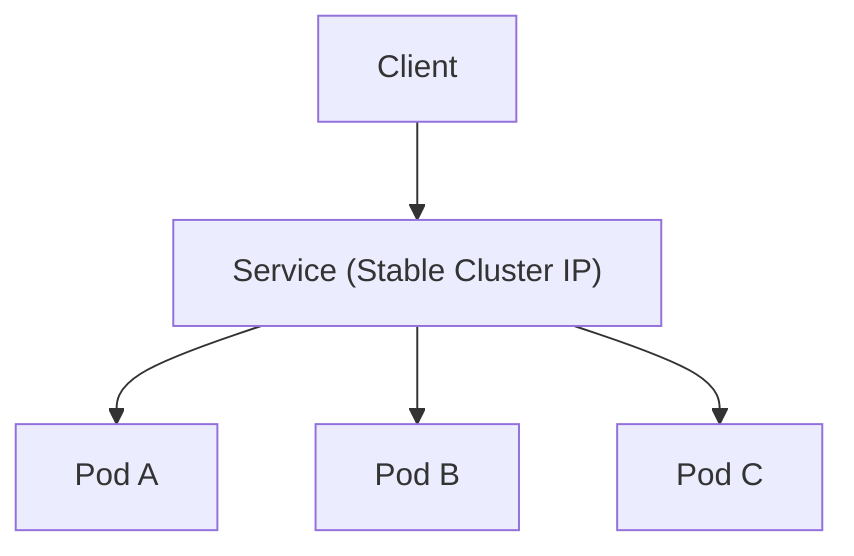

# Services

## Overview

In Kubernetes, Pods are ephemeral and their IP addresses can change whenever Pods are recreated.

A **Service** provides a stable network endpoint in front of a dynamic set of Pods.

It solves key communication problems:

- stable access to changing Pods
- traffic distribution across multiple Pod replicas
- controlled internal or external exposure of applications

Without Services, clients would need to track Pod IP changes continuously.

---

## Why Services Are Needed

Pods are not reliable network identities:

- Pod restarts can change IP addresses
- scaling up/down changes the set of available Pods
- direct Pod-to-Pod addressing is fragile

Services use labels and selectors to route traffic to healthy matching Pods.

This gives consumers one stable DNS name and virtual IP while backend Pods change freely.

---

## How a Service Works Internally

At a high level:

1. Service selects Pods using labels
2. Kubernetes creates Endpoints (or EndpointSlices) for matching Pods
3. `kube-proxy` programs node networking rules
4. Traffic sent to Service IP is load balanced to backend Pods



---

## Core Service Types

The most important Service types for beginners are:

1. **ClusterIP** (default)
2. **NodePort**
3. **LoadBalancer**

---

## 1. ClusterIP

`ClusterIP` exposes the application only inside the cluster.

Use cases:

- backend APIs consumed by other services
- internal databases/cache layers
- microservice-to-microservice communication

Characteristics:

- gets a virtual IP reachable only from cluster network
- automatically load balances across selected Pods
- not directly accessible from internet

### ClusterIP Example

```yaml
apiVersion: v1
kind: Service
metadata:
	name: backend-service
spec:
	type: ClusterIP
	selector:
		app: backend-api
	ports:
		- port: 80
			targetPort: 8080
```

Interpretation:

- clients call Service on port `80`
- Service forwards traffic to Pod container port `8080`

---

## 2. NodePort

`NodePort` exposes the Service on a static port on every node.

Use cases:

- quick testing from outside cluster
- local labs (Minikube, kind, bare-metal demos)
- environments without cloud load balancer integration

Characteristics:

- accessible via `<NodeIP>:<NodePort>`
- node port range is typically `30000-32767`
- routes traffic to Service, then to matching Pods

### NodePort Example

```yaml
apiVersion: v1
kind: Service
metadata:
	name: web-nodeport
spec:
	type: NodePort
	selector:
		app: web
	ports:
		- port: 80
			targetPort: 80
			nodePort: 30080
```

Access pattern:

- `http://<node-ip>:30080`

---

## 3. LoadBalancer

`LoadBalancer` provisions an external load balancer (mostly in cloud environments) and routes internet traffic to your Service.

Use cases:

- public web applications
- external APIs
- production ingress point for simple setups

Characteristics:

- cloud provider allocates external IP or DNS
- forwards traffic to NodePort/ClusterIP path internally
- easiest way to expose app publicly in managed Kubernetes

### LoadBalancer Example

```yaml
apiVersion: v1
kind: Service
metadata:
	name: web-public
spec:
	type: LoadBalancer
	selector:
		app: web
	ports:
		- port: 80
			targetPort: 80
```

Check external address:

```bash
kubectl get svc web-public
```

---

## Service Ports Explained

Service manifests often contain three port-related fields.

| Field | Meaning |
|---|---|
| `port` | Port exposed by the Service |
| `targetPort` | Port on the target Pod container |
| `nodePort` | External node-level port (NodePort only) |

Example mapping:

- client hits Service `port: 80`
- forwarded to Pod `targetPort: 8080`
- if NodePort, may be reachable via `nodePort: 30080`

---

## DNS and Service Discovery

Kubernetes provides internal DNS for Services.

If Service name is `backend-service` in namespace `default`, other Pods can use:

- `backend-service`
- `backend-service.default.svc.cluster.local`

This allows apps to communicate using stable names instead of IP addresses.

---

## Useful Commands

```bash
# List services
kubectl get svc

# Describe service configuration and events
kubectl describe svc backend-service

# Show endpoint Pods behind a service
kubectl get endpoints backend-service

# Create or update service from YAML
kubectl apply -f service.yaml

# Delete service
kubectl delete svc backend-service
```

---

## Common Issues and Troubleshooting

### 1. Service Has No Endpoints

Cause:

- selector labels do not match Pod labels

Check:

```bash
kubectl get pods --show-labels
kubectl describe svc backend-service
kubectl get endpoints backend-service
```

### 2. Service Reachable but App Fails

Cause:

- wrong `targetPort`
- container not listening on expected port

Check container port configuration and application logs.

### 3. NodePort Not Accessible Externally

Cause:

- firewall/security group blocks node port range
- using wrong node IP

Check node address and network rules.

### 4. LoadBalancer External IP Pending

Cause:

- cluster does not support cloud load balancer integration

Common in local clusters; use NodePort or Ingress alternatives.

---

## Best Practices

- Use `ClusterIP` for internal service-to-service traffic.
- Use `NodePort` mainly for development/testing, not as primary production entry.
- Use `LoadBalancer` for simple external exposure in cloud environments.
- Keep label conventions consistent (`app`, `tier`, `env`) to avoid selector mistakes.
- Define readiness probes so traffic is sent only to healthy Pods.
- For advanced HTTP routing and TLS termination, use Ingress with a controller.

---

## Interview Questions

### 1. What problem does a Kubernetes Service solve?

**Answer:**
A Service provides stable networking and load balancing for a changing set of Pods, so clients can use a consistent endpoint even when Pod IPs change.

---

### 2. What is the difference between ClusterIP, NodePort, and LoadBalancer?

**Answer:**
`ClusterIP` is internal-only, `NodePort` exposes the app on each node IP and port, and `LoadBalancer` provisions an external cloud load balancer for public access.

---

### 3. What happens if Service selector labels do not match Pods?

**Answer:**
The Service has no endpoints, so traffic cannot be routed to any backend Pods.

---

### 4. Why is ClusterIP the default Service type?

**Answer:**
Most microservice traffic is internal to the cluster, and ClusterIP provides secure, stable in-cluster communication without exposing services externally.

### 5. How does Kubernetes load balance traffic to Pods behind a Service?

**Answer:**
Kubernetes uses `kube-proxy` to program iptables or IPVS rules on each node, which route traffic sent to the Service IP to one of the healthy backend Pods in a round-robin or random manner.

---

## Summary

* Services provide stable network endpoints for dynamic sets of Pods.

* Core types: ClusterIP (internal), NodePort (external on nodes), LoadBalancer (external with cloud LB).

* Use labels and selectors to connect Services to Pods.

* Define ports carefully to ensure correct routing.

* Troubleshoot with `kubectl describe`, `get endpoints`, and logs.

---