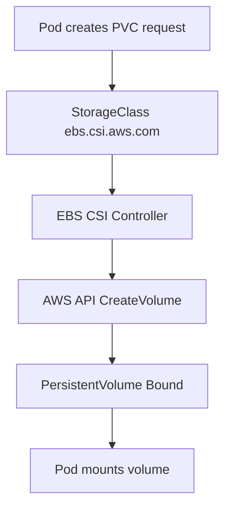

# EKS Storage with EBS Driver

## Overview

This guide explains how to use Amazon EBS volumes in EKS using the AWS EBS CSI driver.

It includes:

- EKS Pod Identity Agent setup
- IAM role and Pod Identity association for EBS CSI
- dynamic volume provisioning with StorageClass + PVC
- MySQL deployment using your existing manifests
- validation and cleanup workflow

This page is aligned with the manifests already present in this repository.

---

## Why EBS CSI Driver Is Needed

Kubernetes does not directly provision AWS EBS volumes by itself.

The EBS CSI driver provides the integration so Kubernetes can:

- create EBS volumes dynamically
- attach/detach volumes to worker nodes
- expose those volumes through PersistentVolumeClaims

Without this driver, PVCs that target EBS-backed storage will remain pending.

---

## High-Level Flow



---

## Prerequisites

- Existing EKS cluster and worker node group
- AWS CLI, kubectl, and eksctl configured on macOS
- kubectl context pointing to your EKS cluster

Quick checks:

```bash
aws sts get-caller-identity
eksctl version
kubectl config current-context
kubectl get nodes
```

---

## Step-01: Install Pod Identity Agent Add-on

Install EKS Pod Identity Agent (if not already installed):

```bash
eksctl create addon \
	--cluster eksdemo1 \
	--region us-east-1 \
	--name eks-pod-identity-agent
```

Verify add-on:

```bash
eksctl get addon --cluster eksdemo1 --region us-east-1
```

---

## Step-02: Create IAM Role for EBS CSI Driver

The EBS CSI controller needs AWS permissions. Attach the managed policy:

- AmazonEBSCSIDriverPolicy

Create role and policy attachment (example with eksctl):

```bash
eksctl create iamserviceaccount \
	--name ebs-csi-controller-sa \
	--namespace kube-system \
	--cluster eksdemo1 \
	--region us-east-1 \
	--role-name AmazonEKS_EBS_CSI_DriverRole \
	--attach-policy-arn arn:aws:iam::aws:policy/service-role/AmazonEBSCSIDriverPolicy \
	--role-only \
	--approve
```

Note:

- We use role-only here so we can map this role using Pod Identity association.

---

## Step-03: Create Pod Identity Association

Map EBS CSI controller service account to the IAM role:

```bash
eksctl create podidentityassociation \
	--cluster eksdemo1 \
	--region us-east-1 \
	--namespace kube-system \
	--service-account-name ebs-csi-controller-sa \
	--role-name AmazonEKS_EBS_CSI_DriverRole
```

Verify association:

```bash
eksctl get podidentityassociation --cluster eksdemo1 --region us-east-1
```

---

## Step-04: Install AWS EBS CSI Driver Add-on

Install the EBS CSI add-on:

```bash
eksctl create addon \
	--cluster eksdemo1 \
	--region us-east-1 \
	--name aws-ebs-csi-driver
```

Verify:

```bash
eksctl get addon --cluster eksdemo1 --region us-east-1
kubectl get pods -n kube-system | grep ebs
```

---

## Step-05: Optional Pod Identity Validation (Using Existing Manifests)

You already have a test service account and aws-cli pod manifest.

Apply:

```bash
kubectl apply -f "EKS Manifests/eks-pod-identity-agent/service-account.yaml"
kubectl apply -f "EKS Manifests/eks-pod-identity-agent/aws-cli-pod.yaml"
```

Exec into pod:

```bash
kubectl exec -it aws-cli -- sh
aws sts get-caller-identity
exit
```

This verifies Pod-level AWS identity flow is working in your cluster.

---

## Step-06: Deploy EBS-backed Storage Manifests (Existing Files)

Apply manifests in this order:

```bash
kubectl apply -f "EKS Manifests/eks-with-ebs-storage/manifests1/storage-class.yaml"
kubectl apply -f "EKS Manifests/eks-with-ebs-storage/manifests1/persistent-volume-claim.yaml"
kubectl apply -f "EKS Manifests/eks-with-ebs-storage/manifests1/usermanagement-ConfigMap.yaml"
kubectl apply -f "EKS Manifests/eks-with-ebs-storage/manifests1/mysql-deployment.yaml"
kubectl apply -f "EKS Manifests/eks-with-ebs-storage/manifests1/mysql-clusterip-service.yaml"
```

What these manifests do:

- storage-class.yaml: defines ebs-sc with provisioner ebs.csi.aws.com
- persistent-volume-claim.yaml: requests 4Gi storage from ebs-sc
- usermanagement-ConfigMap.yaml: provides DB init SQL
- mysql-deployment.yaml: mounts PVC at /var/lib/mysql
- mysql-clusterip-service.yaml: exposes MySQL in-cluster

---

## Step-07: Verify PVC, PV, Pod, and EBS Volume

```bash
kubectl get sc
kubectl get pvc
kubectl get pv
kubectl get pods
kubectl describe pvc ebs-mysql-pv-claim
```

Expected state:

- PVC status should be Bound
- a PV should be dynamically created
- MySQL pod should be Running

AWS-side verification:

- open EC2 console -> Elastic Block Store -> Volumes
- confirm newly created EBS volume linked to your worker node/AZ

---

## Step-08: Persistence Validation

Create data inside MySQL, restart pod, and verify data still exists.

```bash
kubectl exec -it deploy/mysql -- mysql -uroot -pdbpassword -e "show databases;"

kubectl delete pod -l app=mysql
kubectl get pods -w

kubectl exec -it deploy/mysql -- mysql -uroot -pdbpassword -e "show databases;"
```

If the usermgmt database still exists after pod recreation, persistent storage is working.

---

## Cleanup

```bash
kubectl delete -f "EKS Manifests/eks-with-ebs-storage/"

kubectl delete -f "EKS Manifests/eks-pod-identity-agent/"
```

If this was a lab cluster, you can also delete the full EKS cluster to avoid cost.

---

## Common Issues and Fixes

| Issue | Likely Cause | Quick Fix |
|---|---|---|
| PVC stuck in Pending | EBS CSI driver missing or unhealthy | verify aws-ebs-csi-driver add-on and controller pods |
| PVC pending with WaitForFirstConsumer | no pod scheduled yet | create/deploy workload that mounts the PVC |
| Access denied from EBS CSI controller | missing IAM policy/association | validate Pod Identity association and role policy |
| Volume created in different AZ constraints | node scheduling/AZ mismatch | ensure worker node exists in target AZ |
| MySQL restarts lose data | wrong mount path or PVC not bound | verify volumeMount and pvc status |

---

## Best Practices

- Use Pod Identity over static credentials for AWS access from Pods.

- Keep one StorageClass per storage behavior profile.

- For databases, use Recreate strategy if application design requires single-writer semantics.

- Always verify Bound PVC before troubleshooting application-level issues.

- Clean up unused PVCs and EBS volumes to control costs.

---

## Interview Questions

### 1. Why is the AWS EBS CSI driver required in EKS?

Answer:
It enables Kubernetes to dynamically provision and manage EBS volumes through CSI, including attach/detach lifecycle operations.

---

### 2. What is the role of EKS Pod Identity Agent in this setup?

Answer:
It enables Pods and controllers to obtain scoped IAM credentials through Pod Identity association, avoiding static AWS keys.

---

### 3. Why can a PVC remain Pending with WaitForFirstConsumer?

Answer:
Volume provisioning is delayed until a Pod that uses the PVC is scheduled, allowing better AZ-aware placement.

---

### 4. How do you confirm persistence is working for MySQL on EBS?

Answer:
Create data, recreate the Pod, and verify the same data still exists. Also confirm PVC is Bound and PV is attached.

---

## Summary

- EKS persistent storage with EBS requires aws-ebs-csi-driver.

- Pod Identity Agent + IAM role association provides secure AWS permissions to the CSI controller.

- Your existing manifests already define a clean end-to-end lab flow: StorageClass -> PVC -> MySQL deployment -> service.

- Validation should include Kubernetes objects and AWS EBS console checks.

---
