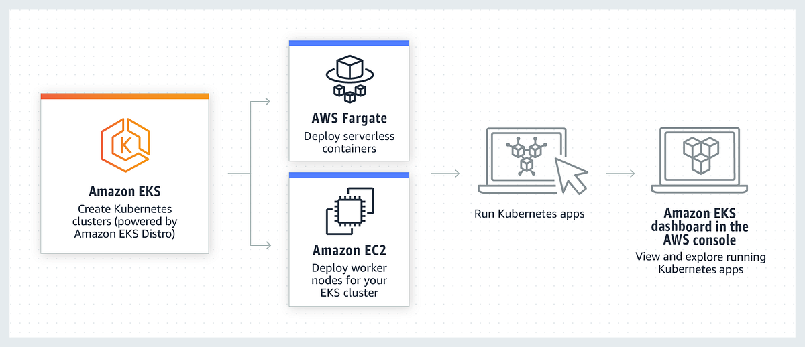
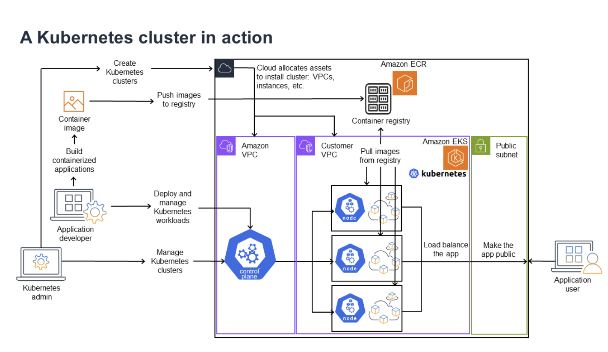
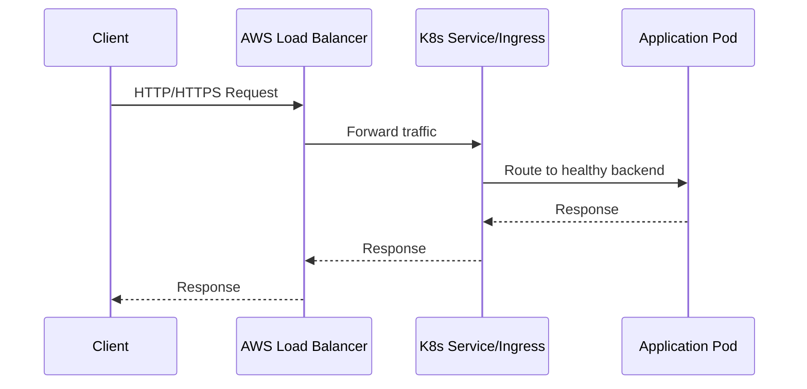

# Overview of EKS

## Overview

Amazon EKS (Elastic Kubernetes Service) is a managed Kubernetes service by AWS.

It allows you to run standard Kubernetes without managing core control plane components like:

- API server
- etcd
- scheduler
- controller manager

With EKS, AWS manages the control plane availability, patching, and scaling, while you manage worker compute, workloads, and application architecture.

---

## Why EKS Is Used

Running Kubernetes from scratch in production is operationally heavy.

EKS reduces operational burden by providing:

- managed and highly available control plane
- integration with AWS IAM, VPC, CloudWatch, and load balancers
- secure-by-default AWS networking controls
- predictable upgrades and enterprise support

EKS is ideal when you want Kubernetes flexibility with cloud-managed reliability.

---

## EKS High-Level Architecture




Key split:

- control plane: managed by AWS
- data plane: managed by you (EC2 nodes, Fargate, or hybrid choices)

---

## Core EKS Building Blocks



### 1. Cluster Control Plane (Managed)

AWS runs and patches Kubernetes control plane components across multiple Availability Zones for resilience.

### 2. Data Plane (Worker Compute)

You choose where Pods run:

- **Managed Node Groups**: AWS-managed EC2 worker lifecycle
- **Self-Managed Nodes**: full control, more ops work
- **AWS Fargate**: serverless Pod execution (no node management)

### 3. Networking (VPC + CNI)

EKS commonly uses Amazon VPC CNI, where Pods receive VPC-routable IP addresses. This simplifies integration with existing AWS networking controls.

### 4. IAM and Access

Authentication/authorization commonly integrates with IAM, and workload-level AWS permissions are usually handled via IRSA (IAM Roles for Service Accounts).

### 5. Observability and Logs

You can collect metrics/logs using CloudWatch, Prometheus/Grafana stacks, and Kubernetes-native tooling.

---

## EKS Networking Flow



---

## EKS vs Self-Managed Kubernetes

| Area | EKS | Self-Managed Cluster |
|---|---|---|
| Control plane operations | AWS-managed | You manage |
| HA control plane setup | Built-in | You design and maintain |
| AWS integrations | Native | Manual integration effort |
| Operational overhead | Lower | Higher |
| Flexibility at infra layer | Moderate | Maximum |

---

## Prerequisites for EKS Walkthrough

Before creating a cluster, ensure:

- AWS account with required IAM permissions
- AWS CLI installed and configured
- `kubectl` installed
- `eksctl` installed

Quick checks:

```bash
aws --version
kubectl version --client
eksctl version
```

Configure AWS credentials and region:

```bash
aws configure
aws sts get-caller-identity
```

---

## Hands-On: Create an EKS Cluster with eksctl

### Step 1: Create Cluster Config

Create a file named `eks-cluster.yaml`:

```yaml
apiVersion: eksctl.io/v1alpha5
kind: ClusterConfig

metadata:
	name: backend-mastery-eks
	region: us-east-1
	version: "1.30"

managedNodeGroups:
	- name: general-workers
		instanceType: t3.medium
		desiredCapacity: 2
		minSize: 2
		maxSize: 4
		volumeSize: 20
		ssh:
			allow: false
```

### Step 2: Create Cluster

```bash
eksctl create cluster -f eks-cluster.yaml
```

This can take 10-20 minutes because AWS provisions networking, IAM roles, and worker infrastructure.

### Step 3: Verify Cluster Access

```bash
kubectl config current-context
kubectl get nodes
kubectl get pods -A
```

If nodes are `Ready`, your EKS data plane is usable.

---

## Deploy a Sample App on EKS

Create `sample-app.yaml`:

```yaml
apiVersion: apps/v1
kind: Deployment
metadata:
	name: sample-nginx
spec:
	replicas: 2
	selector:
		matchLabels:
			app: sample-nginx
	template:
		metadata:
			labels:
				app: sample-nginx
		spec:
			containers:
				- name: nginx
					image: nginx:1.27
					ports:
						- containerPort: 80
---
apiVersion: v1
kind: Service
metadata:
	name: sample-nginx-service
spec:
	type: LoadBalancer
	selector:
		app: sample-nginx
	ports:
		- port: 80
			targetPort: 80
```

Apply and verify:

```bash
kubectl apply -f sample-app.yaml
kubectl get deploy,pods,svc
kubectl get svc sample-nginx-service -w
```

Once `EXTERNAL-IP` is assigned, open it in browser.

---

## EKS Operations You Should Know

```bash
# Scale deployment
kubectl scale deployment sample-nginx --replicas=4

# View rollout status
kubectl rollout status deployment/sample-nginx

# Check events in namespace
kubectl get events --sort-by=.metadata.creationTimestamp

# Inspect node group health at AWS level
eksctl get nodegroup --cluster backend-mastery-eks --region us-east-1
```

---

## EKS Security Essentials

- Use least-privilege IAM policies for users and CI/CD roles.

- Prefer IRSA over static AWS keys inside containers.

- Restrict API server access where possible.

- Use NetworkPolicies for Pod-level traffic control.

- Enable image scanning and avoid untrusted images.

- Encrypt secrets and protect etcd-facing paths through AWS-managed controls.

---

## Common EKS Pitfalls

| Issue | Typical Cause | Quick Check |
|---|---|---|
| `kubectl` cannot connect | wrong context or expired auth | `kubectl config current-context`, `aws sts get-caller-identity` |
| Nodes not joining | IAM or subnet configuration issue | `eksctl utils describe-stacks`, `kubectl get nodes` |
| LoadBalancer pending | subnet tags / cloud integration issue | `kubectl describe svc <name>` |
| Pods cannot reach AWS services | missing IRSA or IAM permissions | service account annotations + IAM role policy |
| high cost unexpectedly | overprovisioned nodes / no autoscaling policy | nodegroup size, instance type, HPA/cluster autoscaler settings |

---

## Cost Awareness Basics

EKS cost usually comes from:

- EKS cluster control plane fee
- EC2 worker nodes (or Fargate usage)
- EBS volumes
- load balancers
- data transfer

Operational best practice:

- right-size node instances
- use autoscaling carefully
- delete unused load balancers and idle clusters

---

## Cleanup

Always clean up to avoid charges:

```bash
eksctl delete cluster --name backend-mastery-eks --region us-east-1
```

---

## Interview Questions

### 1. What does EKS manage, and what do you still manage?

**Answer:**
EKS manages the Kubernetes control plane. You still manage workloads, node sizing strategy, security posture, networking policies, and application lifecycle.

---

### 2. What are the main worker options in EKS?

**Answer:**
Managed Node Groups, self-managed EC2 nodes, and Fargate profiles.

---

### 3. Why is IRSA important in EKS?

**Answer:**
IRSA gives Pods scoped AWS permissions via service accounts, avoiding long-lived static AWS credentials in containers.

---

### 4. When would you use LoadBalancer Service in EKS?

**Answer:**
When exposing an application externally in a straightforward way, especially for public HTTP APIs or web workloads.

---

## Summary

- EKS gives managed Kubernetes control plane on AWS with reduced operations overhead.

- You still design and operate workload architecture, security, and cost controls.

- A practical baseline flow is: configure AWS tooling -> create cluster with `eksctl` -> verify nodes -> deploy app -> expose via LoadBalancer -> monitor -> clean up.

- Strong IAM, networking design, and observability are the keys to production-ready EKS usage.

---
