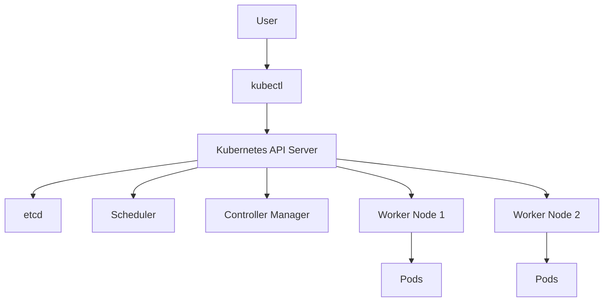

# How to Configure and Run Kubernetes

## Overview

Kubernetes is a container orchestration platform used to deploy, scale, and manage containerized applications.

Configuring Kubernetes correctly means setting up a cluster, connecting `kubectl`, verifying node health, and deploying workloads using manifests.

Running Kubernetes in practice usually starts with a local cluster (for learning and development) and then moves to managed clusters in cloud environments.

A strong setup workflow helps avoid the most common issues: context confusion, networking misconfiguration, and broken deployments.

---

## What "Configure and Run Kubernetes" Means

In practical terms, this process includes:

- installing cluster tooling (`kubectl`, and optionally `minikube` or `kind`)
- creating or connecting to a cluster
- configuring client access via kubeconfig
- validating cluster components and node readiness
- deploying workloads (Pods, Deployments, Services)
- inspecting logs, events, and resource status

Kubernetes setup is not only installation. It is an operational baseline that allows repeatable, stable deployments.

---

## Core Components You Configure



At minimum, your configuration should ensure:

- `kubectl` can reach the API server
- control plane is healthy
- worker nodes are in `Ready` state
- CNI networking is active
- DNS and service discovery work inside the cluster

---

## Prerequisites

- A machine running macOS, Linux, or Windows
- A container runtime (Docker or containerd, depending on cluster option)
- `kubectl` installed
- Local admin/sudo permissions for installation steps

Optional for local clusters:

- `minikube` for single-node local learning
- `kind` (Kubernetes in Docker) for lightweight multi-node testing

---

## Installation and Cluster Setup

### Option 1: Use Minikube

```bash
# Install with Homebrew (macOS)
brew install kubectl minikube

# Start local cluster
minikube start

# Verify cluster access
kubectl cluster-info
kubectl get nodes
```

### Option 2: Use kind

```bash
# Install with Homebrew (macOS)
brew install kubectl kind

# Create cluster
kind create cluster --name dev-cluster

# Verify
kubectl cluster-info --context kind-dev-cluster
kubectl get nodes
```

---

## Configure kubectl Context and Namespace

Kubernetes uses kubeconfig contexts to switch between clusters safely.

```bash
# Show all contexts
kubectl config get-contexts

# Set current context
kubectl config use-context kind-dev-cluster

# Check current context
kubectl config current-context

# Set default namespace for current context
kubectl config set-context --current --namespace=default
```

Using explicit context and namespace reduces accidental deployments to the wrong cluster.

---

## Validate Cluster Health

Before deploying applications, validate the baseline:

```bash
# Nodes should be Ready
kubectl get nodes

# Core system pods should be Running
kubectl get pods -n kube-system

# API and DNS check
kubectl cluster-info
kubectl get svc -n kube-system
```

If nodes are `NotReady`, fix infrastructure/networking first before deploying apps.

---

## Deploy and Run a Workload

Use a simple Deployment and Service to confirm everything works.

```yaml
apiVersion: apps/v1
kind: Deployment
metadata:
	name: nginx-deployment
	labels:
		app: nginx
spec:
	replicas: 2
	selector:
		matchLabels:
			app: nginx
	template:
		metadata:
			labels:
				app: nginx
		spec:
			containers:
				- name: nginx
					image: nginx:1.27
					ports:
						- containerPort: 80
---
apiVersion: v1
kind: Service
metadata:
	name: nginx-service
spec:
	selector:
		app: nginx
	ports:
		- port: 80
			targetPort: 80
	type: ClusterIP
```

Apply and verify:

```bash
kubectl apply -f app.yaml
kubectl get deploy,rs,pods,svc
kubectl describe deployment nginx-deployment
```

---

## Accessing the Application

For local testing, use port-forwarding:

```bash
kubectl port-forward svc/nginx-service 8080:80
```

Then open `http://localhost:8080`.

For cloud clusters, expose with `LoadBalancer` or Ingress based on your environment.

---

## Daily Operational Commands

```bash
# List workloads
kubectl get pods
kubectl get deployments
kubectl get services

# Investigate issues
kubectl describe pod <pod-name>
kubectl logs <pod-name>
kubectl logs <pod-name> -c <container-name>

# Execute command inside container
kubectl exec -it <pod-name> -- /bin/sh

# Watch rollout status
kubectl rollout status deployment/nginx-deployment
```

---

## Common Troubleshooting

| Problem | Likely Cause | Quick Check |
|---|---|---|
| `kubectl` cannot connect | Wrong context or cluster down | `kubectl config current-context`, `kubectl cluster-info` |
| Pod stuck in `Pending` | Insufficient resources or scheduling constraints | `kubectl describe pod <pod>` |
| Pod in `ImagePullBackOff` | Invalid image name or registry auth issue | `kubectl describe pod <pod>` |
| Service not reachable | Selector mismatch or app not listening | `kubectl get svc`, `kubectl get pods --show-labels` |
| CrashLoopBackOff | App process crashing repeatedly | `kubectl logs <pod> --previous` |

---

## Cleanup

```bash
# Delete a specific manifest set
kubectl delete -f app.yaml

# If using kind, delete cluster
kind delete cluster --name dev-cluster

# If using minikube, stop/delete cluster
minikube stop
minikube delete
```

---

## Interview Questions

### 1. What is the first thing to verify after configuring Kubernetes access?

**Answer:**
Verify connectivity and node readiness using `kubectl cluster-info` and `kubectl get nodes`. If nodes are not `Ready`, deployment should not proceed.

---

### 2. Why are contexts important in `kubectl`?

**Answer:**
Contexts define which cluster, user, and namespace commands target. They prevent accidental operations against the wrong environment.

---

### 3. How do you confirm that a deployment is healthy?

**Answer:**
Check rollout status (`kubectl rollout status`), inspect Pods (`kubectl get pods`), and review events/logs if replicas are not becoming ready.

---

### 4. What is a safe way to test service access in a local cluster?

**Answer:**
Use `kubectl port-forward` to map a local port to a Service or Pod and validate HTTP responses locally.

---

## Summary

* Configuring Kubernetes includes tooling install, cluster setup, and kubeconfig context management

* Running Kubernetes workloads requires health validation before deployment

* A basic run flow is: create cluster -> verify nodes -> apply manifests -> inspect status -> view logs

* Most setup failures are detectable quickly through `kubectl describe`, `kubectl logs`, and context checks

* Use repeatable manifests and explicit contexts to avoid operational mistakes

---
